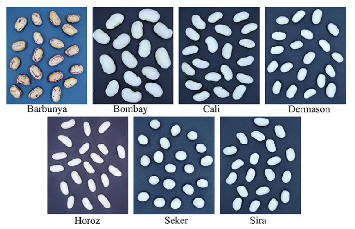

# Automated Classification of Dry Bean Varieties (UCI) — PCA/NoPCA, SMOTE, and Supervised Learning

<center>

**Can you predict the variety of a [dry bean](https://archive.ics.uci.edu/dataset/602/dry+bean+dataset) from engineered morphological features?**

</center>

***



## **Overview:**

<div style='text-align: justify;'>

This project investigates the automated multiclass classification of dry bean varieties using the **UCI Dry Bean dataset**, with a dual focus on **predictive performance** and **economic relevance** (quality grading and transaction-cost reduction in agri-food supply chains). The dataset contains **13,611 observations** and **16 engineered morphological features** (plus the target class). After removing **68 duplicates**, we retain **13,543 unique observations**.

The empirical pipeline is designed to explicitly test whether two common “corrections” in this setting—**dimensionality reduction** and **imbalance handling**—translate into out-of-sample performance gains. We implement unified pipelines combining **RobustScaler**, optional **SMOTE**, optional **PCA** (with k ∈ {2,3,4,5}), and supervised learning with hyperparameter tuning via **GridSearchCV** under **stratified 5-fold cross-validation**. Model selection prioritizes **Macro-F1** and **balanced accuracy**, which are more informative than accuracy under class imbalance.

**Main results:** models trained in the **original feature space (NoPCA)** dominate PCA-based representations. The best-performing configuration is **SVM with an RBF kernel (NoPCA, SMOTE=False)**, achieving **Test Macro-F1 = 0.9369** and **Balanced Accuracy = 0.9357**. The **MLP** is similarly strong (**Test Macro-F1 = 0.9328**). A regularized linear alternative, **Elastic Net logistic regression**, remains highly competitive (**Test Macro-F1 ≈ 0.93**) while preserving interpretability through coefficient shrinkage.

</div>

---

## **Economic & practical relevance**
- **Quality grading and standardization:** reliable classification supports consistent quality labels and reduces grading errors.
- **Lower transaction costs:** automated sorting/verification reduces manual inspection costs and limits disputes between producers, intermediaries, and buyers.
- **Operational scalability:** a model based on morphological features can be deployed in high-throughput settings (e.g., screening lines) with transparent and reproducible decision rules.

---

## **Dataset**
- Dataset: Dry Bean (UCI ML Repository, id=602)
- Task: Multiclass classification (7 classes)
- Instances: 13,611
- Features: 16 numeric predictors (12 dimensional + 4 shape form features)
- Target: Class (`Seker`, `Barbunya`, `Bombay`, `Cali`, `Dermason`, `Horoz`, `Sira`)

---

## **Pipeline (Reproducible Benchmark)**
1. **Data cleaning**: remove duplicates  
2. **Split**: stratified **70/30** train/test split  
3. **Scaling**: `RobustScaler` (median/IQR; robust to outliers)  
4. **Imbalance handling (optional)**: `SMOTE` within the training pipeline (prevents leakage)  
5. **Dimensionality reduction (optional)**: `PCA` with k ∈ {2,3,4,5}  
6. **Tuning**: `GridSearchCV` with stratified 5-fold CV (objective: Macro-F1)  
7. **Evaluation**: Macro-F1 + balanced accuracy + confusion matrix + ROC OvR/AUC  

---

## **Best Model (Test Set)**
- **SVM (RBF kernel)** — `NoPCA`, `SMOTE=False`  
  - Accuracy: **0.9259**  
  - Balanced Accuracy: **0.9357**  
  - **Macro-F1: 0.9369**

(See the report for confusion matrix and ROC curves of the best model and ElasticNet.)

---

## **Dataset Description**

<table>
    <tr>
        <th><center> Variable </center></th>
        <th><center> Type </center></th>
        <th><center> Description / Formula </center></th>
        <th><center> Units </center></th>
    </tr>
    <tr><td><center> Area </center></td><td><center> Integer </center></td><td><center> Area of a bean zone (pixel count). </center></td><td><center> pixels </center></td></tr>
    <tr><td><center> Perimeter </center></td><td><center> Continuous </center></td><td><center> Bean circumference (border length). </center></td><td><center> — </center></td></tr>
    <tr><td><center> MajorAxisLength </center></td><td><center> Continuous </center></td><td><center> Longest line distance that can be drawn from a bean. </center></td><td><center> — </center></td></tr>
    <tr><td><center> MinorAxisLength </center></td><td><center> Continuous </center></td><td><center> Longest line perpendicular to the major axis. </center></td><td><center> — </center></td></tr>
    <tr><td><center> AspectRatio </center></td><td><center> Continuous </center></td><td><center> MajorAxisLength / MinorAxisLength </center></td><td><center> — </center></td></tr>
    <tr><td><center> Eccentricity </center></td><td><center> Continuous </center></td><td><center> Eccentricity of the ellipse with the same moments as the region. </center></td><td><center> — </center></td></tr>
    <tr><td><center> ConvexArea </center></td><td><center> Integer </center></td><td><center> Pixel count of the smallest convex polygon containing the bean. </center></td><td><center> pixels </center></td></tr>
    <tr><td><center> EquivDiameter </center></td><td><center> Continuous </center></td><td><center> Diameter of a circle with the same area as the bean region. </center></td><td><center> — </center></td></tr>
    <tr><td><center> Extent </center></td><td><center> Continuous </center></td><td><center> (pixels in bounding box) / Area </center></td><td><center> — </center></td></tr>
    <tr><td><center> Solidity </center></td><td><center> Continuous </center></td><td><center> Convexity: (pixels in convex hull) / (pixels in bean region). </center></td><td><center> — </center></td></tr>
    <tr><td><center> Roundness </center></td><td><center> Continuous </center></td><td><center> (4π · Area) / (Perimeter²) </center></td><td><center> — </center></td></tr>
    <tr><td><center> Compactness </center></td><td><center> Continuous </center></td><td><center> EquivDiameter / MajorAxisLength </center></td><td><center> — </center></td></tr>
    <tr><td><center> ShapeFactor1 </center></td><td><center> Continuous </center></td><td><center> MajorAxisLength / Area </center></td><td><center> — </center></td></tr>
    <tr><td><center> ShapeFactor2 </center></td><td><center> Continuous </center></td><td><center> MinorAxisLength / Area </center></td><td><center> — </center></td></tr>
    <tr><td><center> ShapeFactor3 </center></td><td><center> Continuous </center></td><td><center> (4 · Area) / (MajorAxisLength · π) </center></td><td><center> — </center></td></tr>
    <tr><td><center> ShapeFactor4 </center></td><td><center> Continuous </center></td><td><center> (4 · Area) / (MajorAxisLength · MinorAxisLength · π) </center></td><td><center> — </center></td></tr>
    <tr><td><center> Class </center></td><td><center> Categorical </center></td><td><center> Dry bean variety label: {Seker, Barbunya, Bombay, Cali, Dermason, Horoz, Sira}. </center></td><td><center> — </center></td></tr>
</table>

---

## **Models Implemented**
1. **Logistic Regression** (multinomial baseline)  
2. **Elastic Net Logistic Regression** (L1/L2 regularization for multicollinearity + interpretability)  
3. **SVM (RBF kernel)**  
4. **MLP (Multilayer Perceptron)**  

---

## **How to Run**

### 1) Install dependencies
```bash
pip install -r requirements.txt
